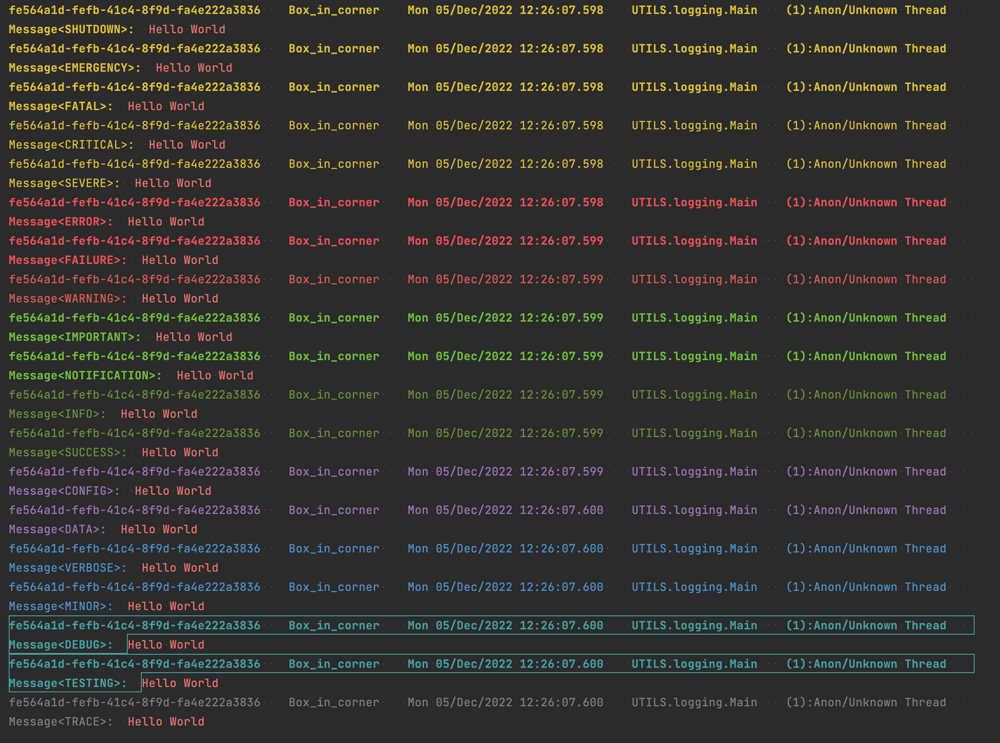

# java-custom-logging

[](https://github.com/CalumD/java-custom-logging/actions/workflows/simple-tests.yml)
[](https://www.azul.com/downloads/?version=java-21-sts&package=jdk)
[](https://junit.org/junit5/docs/current/user-guide/)
[](https://github.com/CalumD/java-custom-logging/releases)
[](https://maven-badges.herokuapp.com/maven-central/com.clumd.projects/java-custom-logging)
[](https://github.com/CalumD/java-custom-logging/actions/workflows/CodeQL.yml)

My own custom implementation of the SLF4J interface, but with bonuses for using it directly.

Best used with a simple Maven import

```xml

<dependency>
    <groupId>com.clumd.projects</groupId>
    <artifactId>java-custom-logging</artifactId>
    <version>1.0.1</version>
</dependency>
```

You may also need to EXCLUDE other dependencies if they provide a SLF4J implementation, and you want to use this lib.

### Logging

I hate the built-in logging, I find it too limiting, and the output formats are imo, yukky.
I also don't like how much effort 3rd party libraries are to integrate, still with a similar level of complexity /
limited functionality (the docs are often way too long).
This attempts to be a wholly self-contained logging extension library to make logs way more pleasant for me, and
hopefully for you too.
It supports full colourised terminal output through ASCII escape codes.
It also extends the range of available Log Levels to the following



##### Usage

In order to make use of this Logging extension, you must first initialise some basic variables in the static LogRoot
class. Something along the lines of:

```java
LogRoot.init(
        "com.clumd.projects.java_common_utils.",
        "UTILS",
        "Box_in_corner"
).withHandlers(List.of(
        LogRoot.basicConsoleHandler(true),
        LogRoot.basicFileHandler("<some local filesystem path>")
));
```

The first variable in the init should be the fully qualified path of whatever piece of code is using this Logger. Since
the majority of logs will likely be coming from the code you're implementing, it allows the logger to truncate the
package you already know from logger formatting - allowing you to focus on the actual classes you have.
Please note, that this MUST end in the trailing 'dot' to be useful.

The second variable is the 'Logging Root ID', this text will be prefixed to the ID of every logger, and should usually
be set to the most succinct version of the name of your project.

The third variable is the 'system ID'. It is optional, but denotes the name you would like to assign the machine running
your code.
For example, if you had multiple instances of your application running on 3 physically distinct machines, but you are
aggregating your logs somewhere else, you would benefit from this field to identify which machine a message came from.

The two loggers in the `.withHandlers()` call, are some convenient defaults to give you a Console logger (the boolean
refers to if extra spacing should be output for a more compact console or not), and a File logger (where you would
obviously use a real path).

After the initialisation step, you can then create Loggers with the following syntax from anywhere in your code:

```java
// Class<?>
LogRoot.createLogger(Main.class);

// String loggerIdentifier
LogRoot.createLogger("my.first.logger");

// String prefix, String loggerIdentifier
LogRoot.createLogger("special","my.first.logger");
```

##### Examples

Below are some example outputs you may expect from the above configuration:

- On the console
    ```log
    4f55a2c3-bc48-404a-817f-3c213e18f949    Box_in_corner    Mon 05/Dec/2022 11:56:17.229    UTILS.logging.Main    (1):Anon/Unknown Thread    
    Message<INFO>:  test
    
    4f55a2c3-bc48-404a-817f-3c213e18f949    Box_in_corner    Mon 05/Dec/2022 11:56:17.249    UTILS.my.first.logger    (1):Anon/Unknown Thread    
    Message<INFO>:  test
    
    4f55a2c3-bc48-404a-817f-3c213e18f949    Box_in_corner    Mon 05/Dec/2022 11:56:17.251    UTILS.special:my.first.logger    (1):Anon/Unknown Thread    
    Message<INFO>:  test
    
    ```
- Into a file
    ```log
    {"threadID":1,"traceID":"308a8a1c-0cb2-407f-a47f-238af7d04c7a","dateTime":"2022-12-05T11:58:19.100","level":"INFO","logger":"UTILS.logging.Main","publisher":"Box_in_corner","message":"test","threadName":"Anon/Unknown Thread","machineDateTime":1670241499100}
    {"threadID":1,"traceID":"308a8a1c-0cb2-407f-a47f-238af7d04c7a","dateTime":"2022-12-05T11:58:19.127","level":"INFO","logger":"UTILS.my.first.logger","publisher":"Box_in_corner","message":"test","threadName":"Anon/Unknown Thread","machineDateTime":1670241499127}
    {"threadID":1,"traceID":"308a8a1c-0cb2-407f-a47f-238af7d04c7a","dateTime":"2022-12-05T11:58:19.130","level":"INFO","logger":"UTILS.special:my.first.logger","publisher":"Box_in_corner","message":"test","threadName":"Anon/Unknown Thread","machineDateTime":1670241499130} 
    ```

If you get a logger, but list the return type as a `com.clumd.projects.java_common_utils.logging.ExtendedLogger`, then
you can call some custom methods for the notion of "tagging".
Tagging in this sense comes from the use-case where distinct Loggers, may want to output conceptually related messages,
but in vastly different areas of code - only some of the time.

For example imagine the hypothetical: you have a logger who logs everything it reads from a Socket. 99% of the time,
this is just some text output, but 1% of the time, it finds some security exception. Additionally, you have some 'user
management' class who logs the operations a user carries out, including Security exceptions when users try to do
something they don't have permissions for.
Rather than just search through the entire body of all messages logged to find security exceptions from either the
Socket reader or the user manager, you could just "tag" those messages with `security`. If you are aggregating this
output somewhere else, you may want to have additional indexes for these specific messages, and pick them out of the
noise with ease.

Using a tag could be done like below followed by example outputs - though please check the `ExtendedLogger` class for
all options available.

```java
log.log(CustomLevel.INFO, Set.of("security", "tag example"), () -> "test");
```

```log
f7f3ab47-ba35-4fdb-9d34-9883623d5819    Box_in_corner    Mon 05/Dec/2022 12:15:05.997    UTILS.logging.Main    (1):Anon/Unknown Thread    
[security, tag example]
Message<INFO>:  test

{"threadID":1,"traceID":"f7f3ab47-ba35-4fdb-9d34-9883623d5819","dateTime":"2022-12-05T12:15:05.997","level":"INFO","logger":"UTILS.logging.Main","publisher":"Box_in_corner","message":"test","threadName":"Anon/Unknown Thread","machineDateTime":1670242505997,"tags":["security","tag example"]}
```
